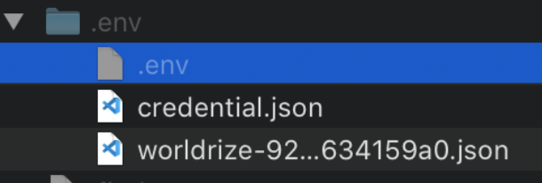
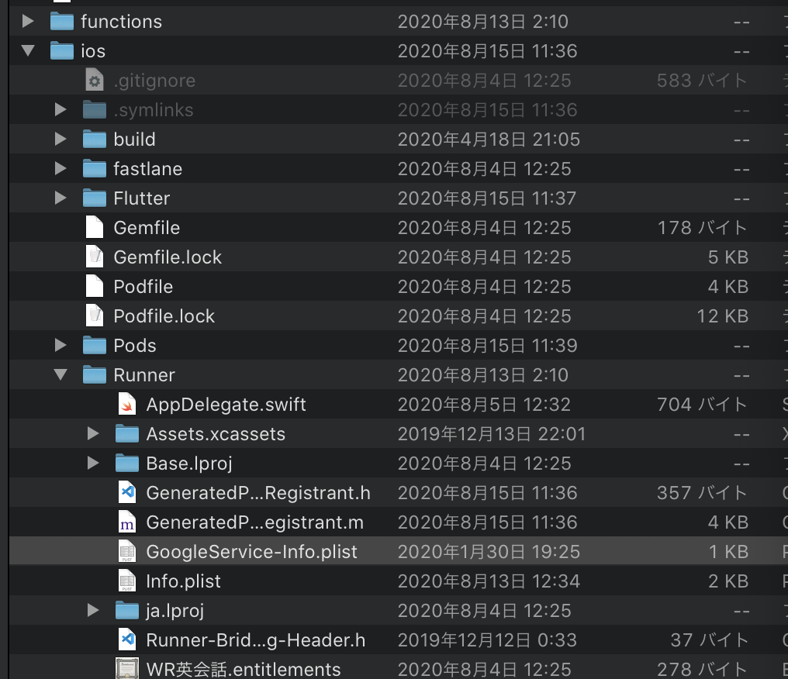
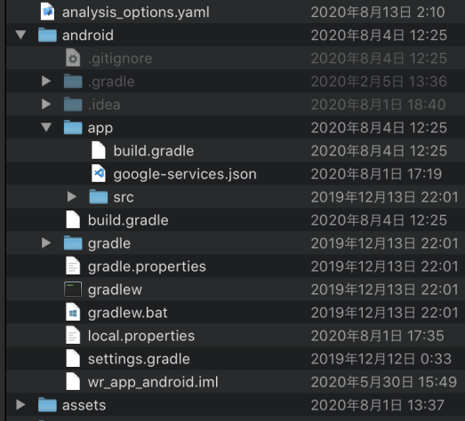
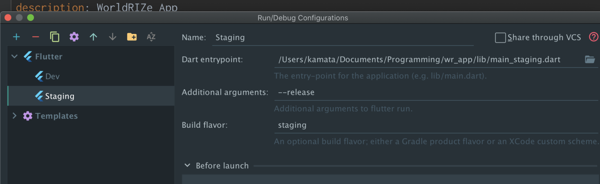

# Setup
## 🌴 Environments
### App
- [Android Studio 4.0](https://developer.android.com/studio/install?hl=ja)
- Xcode Version 11.5 (11E608c)
- [Flutter](https://flutter.dev/docs/get-started/install) (Channel dev, v1.16.1, on Mac OS X 10.15.3 19D76, locale ja-JP)
- Cocoa pods 1.9.3

### Functions
- TypeScript 3.8.3
- node v10.20.1
- yarn 1.22.0
Firebaseにデプロイ

### Database
- Firebase Firestore

### Assets
- Google Drive
- [Woord API](https://www.getwoord.com/pages/text-to-speech-api)
- [Contentful](https://www.contentful.com/)

### Tools
- Python 3.8.1
- [rake](https://docs.ruby-lang.org/ja/latest/library/rake.html), version 12.3.2
- [n](https://github.com/tj/n) 2.1.12

### Services
- Apple Developper
- Firebaseの色々
- App Store Connect
- [codemagic](https://codemagic.io/start/)
  - アプリ用CI/CDサービス

## 👍 Get Started
### 1. `.env` をもらう
- **.env file** @ `./.env/.env`



### 2. Firebase credentials をダウンロード
<https://support.google.com/firebase/answer/7015592?hl=ja>

- **admin credentail** @ `./.env/credential.json`
- **web credential** @ `./.env/worldrize-9248e-d680634159a0.json`
- **android credential** `./android/app/google-services.json`
- **ios credential** `./ios/Runner/GoogleService-Info.plist`

Android, iOSのCredentialを配置する





### 3. パッケージ
```
cd ios
pod install
```

```
flutter pub get
```

### 4. Init Script
アセットとかがダウンロードされます

```bash
rake init # download & build assets
```

### 4. シミュレータ起動

### 5. 実行
Android Studio から実行  
または
```bash
rake dev # build & launch app
```

## Android Studio Build  Configurations
- development


- staging


## リリースの仕方
TODO

[証明書周り](https://shigu493.com/%E3%80%90ios%E3%80%91%E8%A4%87%E9%9B%91%E3%81%AA%E8%A8%BC%E6%98%8E%E6%9B%B8%E5%91%A8%E3%82%8A%E3%82%92%E3%81%82%E3%81%A3%E3%81%95%E3%82%8A%E6%95%B4%E7%90%86/)