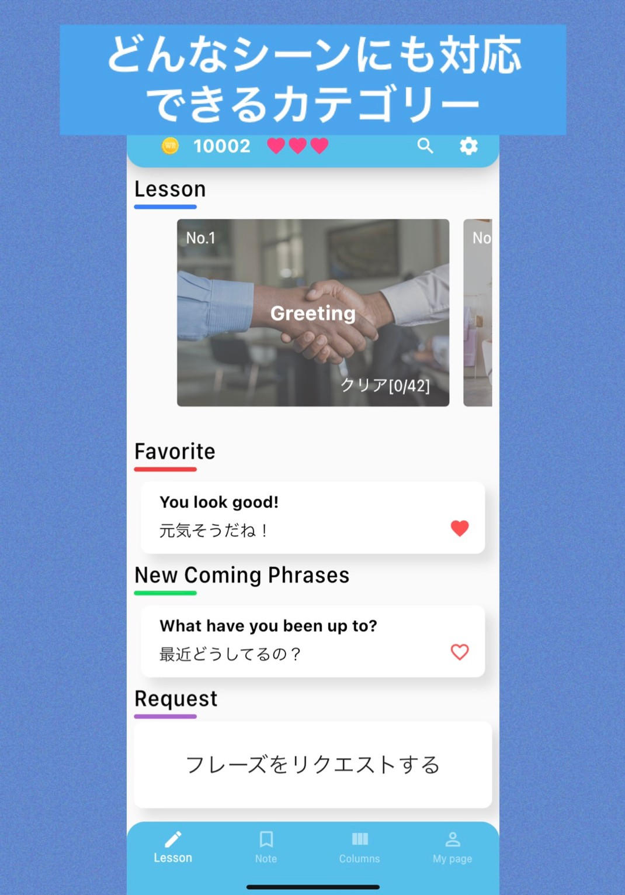
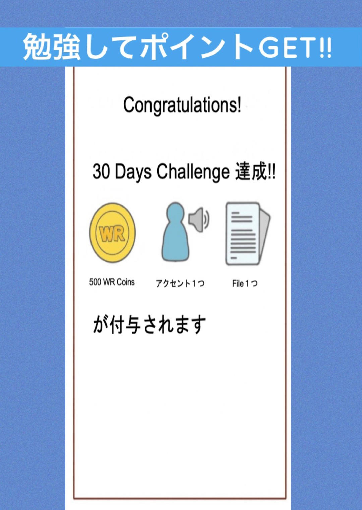
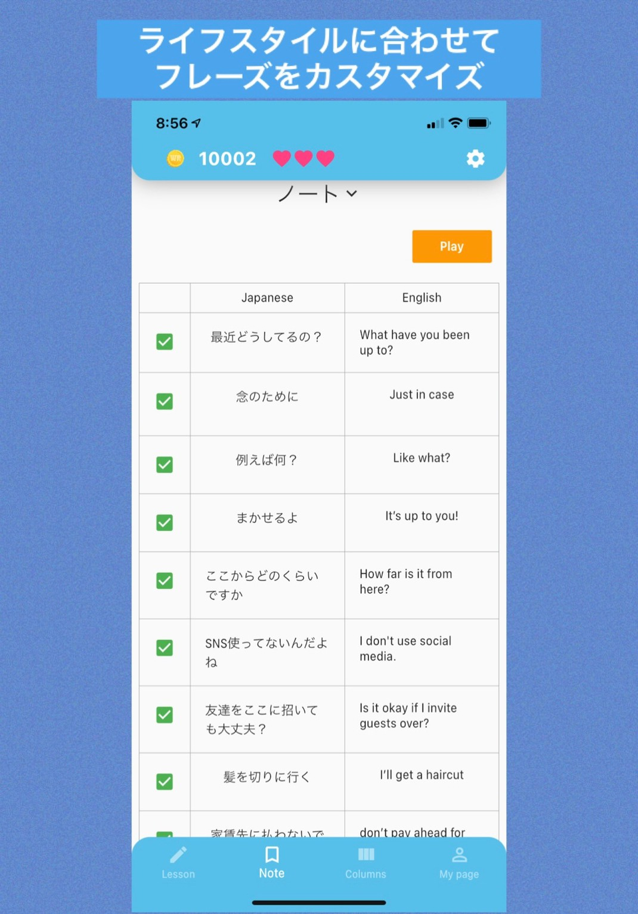
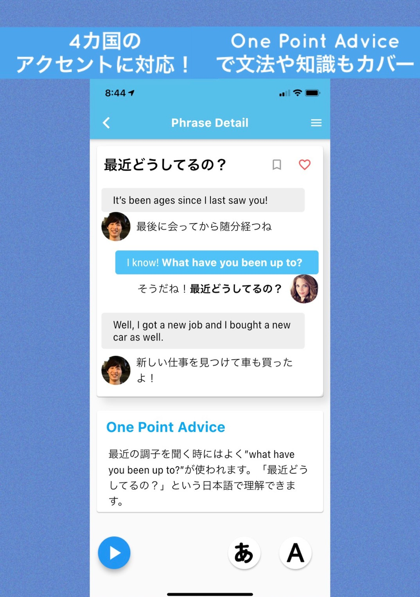

# Android
## アプリ名
WR英会話

## 簡単な説明
日常生活で頻繁に使われる表現を「Key Phrase」として15カテゴリーに分けて紹介！【業界初】勉強してWR Coinsをゲットしてギフトコードに交換できる！

## 詳しい説明
【主な機能】
・Lesson機能：厳選された日常で使う英会話フレーズを15種類の場面に分けて紹介！
　　・4つのアクセントが学べる：アメリカ, イギリス, オーストラリア, インドのアクセントを搭載
　　・5段階の音声読み上げ速度調節
　　・One Point Advice：紹介したフレーズの言い換えの表現や、覚えておくと応用できる文法。なぜそのフレーズがその意味になるかなど幅広い知識を紹介しています。
　　・Favourite：テストで間違えてしまったフレーズや覚えづらいと感じるフレーズなど、特定のフレーズをFavoriteすることができます。Favouriteされたフレーズは別で一覧できます。スワイプでフレーズの並び替えをして自分オリジナルのフレーズ帳を作ろう！

・Test機能：学習したフレーズの理解度を測ることができます。正解した問題数だけWR Coinsがもらえる！

・Column機能：英語や留学, ワーホリなどに関する様々な知識や情報を得ることができます！
　　・オンライン英会話：現役留学生が実際に10社以上利用した中から厳選し、提携した1つのオンライン英会話会社を紹介しています
　　・Articles：留学やワーホリなど海外に関係する様々な情報や体験談を募集&投稿しています。
　　・Random Facts：文法の解説や豆知識など幅広い分野を図を用いてわかりやすく解説しています。
　　・Useful Information：現役留学生の英語学習方法や実際に利用している便利なサービスを紹介しています。

・Note機能：Lessonで紹介されている「キーフレーズ」を自分でカスタマイズをすることができます。また、自分で新しくフレーズや単語も入力してご利用していただけます。「Play」を押すと簡単にフラッシュカードの画面に切り替わります。フラッシュカードを通して瞬間英作文の力を鍛えよう！

・Agency機能：WR英会話を通して学んだユーザーが留学やワーキングホリデーなど海外に行く際に安心して渡航できるようにお手伝いをするエージェント会社を紹介する機能です。数あるエージェント会社の中からWorld RIZeが安心してご利用できる会社を留学生の視点から選定し提携しています。留学・ワーキングホリデーにご興味がございましたら、WR英会話を通してお気軽にエージェント会社にお問い合わせいただけます。

・友達紹介機能：WR英会話を通してユーザー同士でお互いに学習を促進しあえる機能です。友達にWR英会話を紹介してWR Coinsをゲットしよう！

・WR Coins交換機能：テスト合格や友達紹介などでゲットしたWR CoinsをAmazonギフトカードやiTunesカードなどのギフト券との交換や、WR英会話の機能拡張として使うことができます。

【WR英会話とは】
現役留学生とネイティブが共同制作した今までにない英会話アプリ。「英語で楽しく自信を持ってコミュニケーションを取りたい」と思う方々に最短でそのゴールを達成するためのメソッドを共有します。

「知識力×瞬発力＋自分の言葉に置き換える」これらのスキルが英会話をマスターする上で必須になっています。

ここでいう「知識力×瞬発力」とは「単語・文法・発音を中心とした正しい知識を選択し、それを瞬間的に1つの文にする」というスキルです。これらの知識力はWR英会話のLessonによって十分に鍛えられます。

次に、瞬発力とは「英語の文章を一瞬で作る力」を指します。WR英会話では瞬間英作文ができるようになる仕組みを取り入れています。例えば、Note機能においてはフレーズを縦に一覧にすることによって勉強の効率の向上を図っています。そしてPlayを押すと簡単にフラッシュカードとしてフレーズが学べるようになっています。

では、フレーズを丸暗記すれば英語を話すことができるのか？それは全く違います。

英会話スクールや他の英語アプリケーションには英語フレーズを丸暗記すればいいと宣言しているものが多くありますが、私たちはそれでは十分に英語でのコミュニケーションは取れないと思っています。

大切なのは「自分の言葉で置き換えること」です。

WR英会話では紹介しているフレーズをユーザーの生活スタイルに合った単語に変更してカスタマイズすることができます。

例えば、Lessonでは”Do you need me to work?”「残業した方がいい？」と仕事のワンシーンを表していますが、”Do you need me to clean your room?”「部屋を掃除した方がいい？」とカスタマイズすることによって、1つの「キーフレーズ」に対しての汎用性が高まります。

さらに、アプリケーションで勉強することの課題の1つに「継続すること」が挙げられます。それを解決する方法の1つとしてWR英会話ではユーザーがポイントを獲得できる機能があります。
WR英会話ではWR Coinsというポイントをテスト合格後や友達紹介で獲得することができます。このポイントはAmazonギフト券などに交換できたり、アプリケーション内でのサービス拡張として使うことができます。また、WR英会話では30 days bonusと題して、テストを毎日30日間こなしたユーザーに対し、拡張機能の一部やWR CoinsなどWorld RIZeからプレゼントさせていただきます。

英語脳を効率よく作り上げ継続する事ができる英会話アプリ。それがWR英会話です。

## アプリのアイコン

## スクリーンショット(仮)

